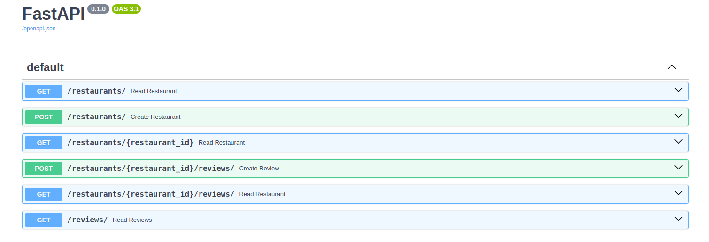
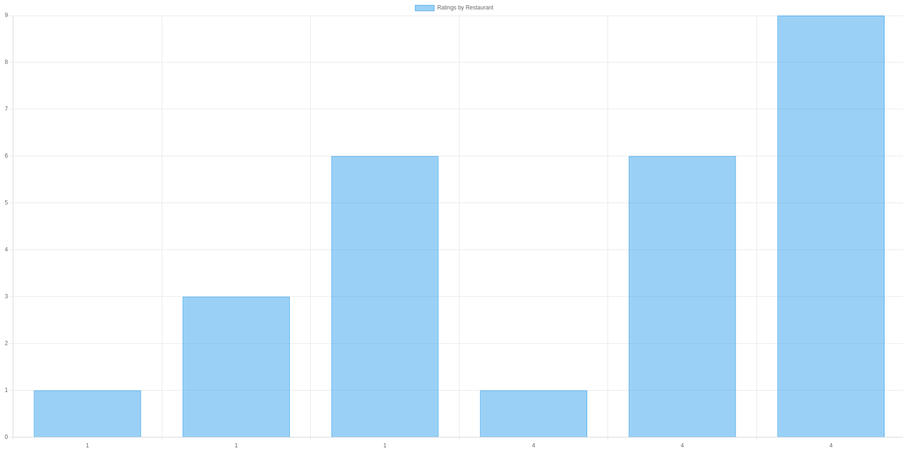

# API de Avaliação de Restaurantes - Prova de Conceito

## Descrição

Este projeto é uma prova de conceito em desenvolvimento, criado com FastAPI para avaliar e listar restaurantes, utilizando TinyDB como banco de dados. A API proporciona operações CRUD para gerenciar restaurantes e suas avaliações, e já conta com testes unitários implementados através do pytest, assegurando a funcionalidade conforme evolui.

## Setup

1.  Instale as dependências:

bashCopy code

`pip install fastapi[testing] tinydb pytest pytest-cov httpx` 

2.  Execute a API:

bashCopy code

`uvicorn main:app --reload` 

## Endpoints

-   `POST /restaurants/`: Cria um novo restaurante.
-   `GET /restaurants/{restaurant_id}`: Retorna os detalhes de um restaurante específico.
-   `GET /restaurants/`: Retorna todos os restaurantes.
-   `POST /restaurants/{restaurant_id}/reviews/`: Adiciona uma avaliação a um restaurante específico.
-   `GET /reviews/`: Retorna avaliações baseado em filtros opcionais de `restaurant_id` e `review_id`.
-   `GET /dashboard/`: monta uma pequena dashboard com as notas dos restaurantes.

## Testes

Para executar os testes e verificar a cobertura, use o seguinte comando:

bashCopy code

`pytest --cov=main test_main.py` 

## Banco de Dados para Teste

Configure o caminho do banco de dados para um arquivo separado ao execut

ar testes, definindo a variável de ambiente `DB_PATH` para apontar para um banco de dados de teste:

bashCopy code

`export DB_PATH='test_db.json'` 

Certifique-se de limpar o banco de dados de teste antes e/ou depois de cada execução de teste para garantir que os testes sejam reprodutíveis. Uma fixture pytest pode ser usada para esta finalidade no arquivo `test_main.py`.

## Aviso de Depreciação

Se você estiver usando uma versão mais recente do Pydantic (v2.0 ou superior), substitua o método `dict()` por `model_dump()` conforme avisos de depreciação sugerem.

## Resumo

Este projeto serve como um ponto inicial para explorar o desenvolvimento de APIs com FastAPI e TinyDB, apresentando uma estrutura básica para operações CRUD e testes unitários.

### Padrões de Design Introduzidos:

1.  **Padrão Repository**:
    -   Separamos as operações do banco de dados da lógica de negócios.
    -   Criamos classes de repositório específicas (`RestaurantRepository` e `ReviewRepository`) para gerenciar as operações relacionadas a restaurantes e avaliações, respectivamente.
    -   Isso simplificou os endpoints FastAPI, já que agora eles interagem com os repositórios em vez de acessar o banco de dados diretamente.

### Testes:

-   Refatoramos os testes para refletir as mudanças feitas no código.
-   Introduzimos um `fixture` para limpar o banco de dados de teste antes e depois de cada teste, garantindo que cada teste seja executado em um ambiente limpo.
-   Atualizamos os testes para usar o banco de dados de teste e garantir que as operações de CRUD estejam funcionando conforme esperado.

### Benefícios da Refatoração:

1.  **Modularidade**:
    -   O código agora está mais modular com clara separação entre lógica de negócios e operações de banco de dados.
2.  **Testabilidade**:
    -   Os repositórios podem ser facilmente simulados ou substituídos em testes, tornando os testes mais confiáveis e fáceis de escrever.
3.  **Manutenibilidade**:
    -   Com a separação de responsabilidades, futuras mudanças ou expansões do código serão mais fáceis de implementar.

### Como Rodar o Projeto:

1.  Instale as dependências (você pode listar as dependências específicas aqui).
2.  Configure a variável de ambiente `DB_PATH` se desejar usar um caminho de banco de dados diferente do padrão `db.json`.
3.  Execute o FastAPI.
4.  Use os endpoints para criar, ler e gerenciar restaurantes e avaliações.

## Escopo

- [ ] Autenticação: Implemente um sistema de autenticação para garantir que apenas usuários registrados possam avaliar restaurantes e deixar comentários.

- [X] CRUD: Certifique-se de que sua API suporte operações CRUD (Create, Read, Update, Delete) para restaurantes e avaliações.

- [ ] Validação: Adicione validação de dados para garantir que as informações inseridas pelos usuários sejam corretas e completas.

- [X] Documentação: Documente sua API usando padrões como OpenAPI ou Swagger, isso tornará mais fácil para outros desenvolvedores entenderem como usar sua API.

- [X] Testes: Escreva testes unitários e de integração para garantir que sua API funcione como esperado, mesmo após futuras atualizações.

- [ ] Filtro e Ordenação: Implemente funcionalidades de filtragem e ordenação para que os usuários possam buscar restaurantes com base em diferentes critérios, como classificação média, tipo de cozinha ou localização.

- [ ] Paginação: Adicione suporte à paginação para lidar com um grande número de restaurantes ou avaliações.

- [ ] Respostas de Erro Claras: Certifique-se de que sua API retorne mensagens de erro claras e úteis quando as coisas derem errado.

https://tinydb.readthedocs.io/en/latest/